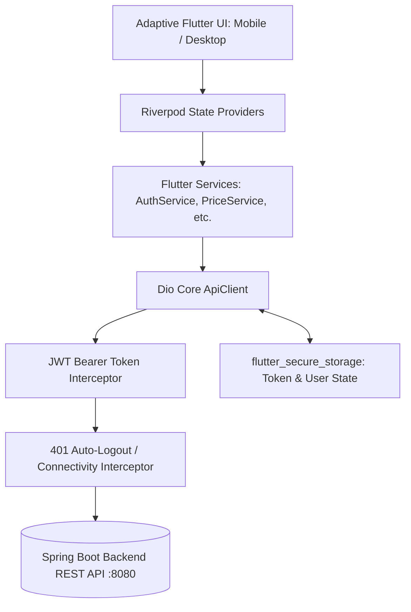

# KisanLink Flutter Multiplatform API Mapping Document
**Target Codebase:** `flutter_app/` (Android Mobile & Windows Desktop)  
**Backend Reference:** `kisanlink-backend/src/main/java/com/kisanlink/controller` (Spring Boot 3, Java 21/25)  
**Date:** September 2026

---

## 1. Executive Summary & Design Constraints

1. **Zero-Duplication Rule:**  
   All heavy domain logic, financial escrow state machines, dynamic fee calculations, net realization modeling, and ML predictions remain exclusively on the Spring Boot backend. Flutter operates as an adaptive presentation, interaction, and caching client.
2. **Network Address Resolution:**
   - Windows Desktop / Web: `http://localhost:8080/api`
   - Android Emulator: `http://10.0.2.2:8080/api`
   - Physical Devices / LAN: Configurable via environment config (`BASE_URL` override).
3. **Authentication Mechanism:**
   - Standard HTTP header: `Authorization: Bearer <JWT_TOKEN>`
   - Stored securely in platform keychain / Windows DPAPI via `flutter_secure_storage`.
4. **Platform Roles (`com.kisanlink.entity.Role`):**
   - `FARMER`
   - `BUYER`
   - `TRANSPORTER`
   - `ADMIN`
   - `FPO`

---

## 2. Comprehensive Controller & Endpoint Mapping

Below is the complete catalogue of all 29 backend controllers with their HTTP methods, role authorizations, payload DTOs, and mapped Flutter client services.

### 1. `AuthController` (`/api/auth`)
*Public endpoints for identity lifecycle.*
| Method | Endpoint | Access | Request DTO | Response DTO | Mapped Flutter Service |
|---|---|---|---|---|---|
| `POST` | `/api/auth/register` | Public | `RegisterRequest` | `AuthResponse` | `AuthService.register()` |
| `POST` | `/api/auth/login` | Public | `LoginRequest` | `AuthResponse` | `AuthService.login()` |
| `POST` | `/api/auth/refresh` | Authenticated | Token Header | `AuthResponse` | `AuthService.refreshToken()` |
| `GET`  | `/api/auth/me` | Authenticated | None | `UserDto` | `AuthService.getCurrentUser()` |

### 2. `CropController` (`/api/crops`)
*Master agricultural catalog and crop metadata.*
| Method | Endpoint | Access | Request DTO | Response DTO | Mapped Flutter Service |
|---|---|---|---|---|---|
| `GET` | `/api/crops` | Public | `page, size, search` | `Page<CropDto>` | `CropService.getCrops()` |
| `GET` | `/api/crops/{id}` | Public | None | `CropDto` | `CropService.getCropById()` |
| `POST` | `/api/crops` | `ADMIN` | `CreateCropRequest` | `CropDto` | `AdminService.createCrop()` |
| `PUT` | `/api/crops/{id}` | `ADMIN` | `UpdateCropRequest` | `CropDto` | `AdminService.updateCrop()` |

### 3. `PriceController` (`/api/prices`)
*Live AGMARKNET mandi rates, modal prices, and MSP reference rates.*
| Method | Endpoint | Access | Request DTO | Response DTO | Mapped Flutter Service |
|---|---|---|---|---|---|
| `GET` | `/api/prices/live` | Public | `cropId, marketId` | `List<PriceDto>` | `PriceService.getLivePrices()` |
| `GET` | `/api/prices/history` | Public | `cropId, marketId, days` | `List<PriceHistoryDto>` | `PriceService.getPriceHistory()` |
| `GET` | `/api/prices/msp` | Public | `cropId` | `MspPriceDto` | `PriceService.getMspPrice()` |
| `GET` | `/api/prices/trends` | Public | `commodity` | `List<PriceTrendDto>` | `PriceService.getTrends()` |

### 4. `PredictionController` (`/api/predictions`)
*AI/ML price forecast models, confidence bands, and trend trajectories.*
| Method | Endpoint | Access | Request DTO | Response DTO | Mapped Flutter Service |
|---|---|---|---|---|---|
| `GET` | `/api/predictions/crop/{cropId}` | Public | `daysAhead` | `PredictionResultDto` | `PredictionService.getForecast()` |
| `GET` | `/api/predictions/market/{marketId}` | Public | `commodity` | `MarketPredictionDto` | `PredictionService.getMarketForecast()` |

### 5. `MarketController` (`/api/markets`)
*Physical Mandi directories, locations, and trading yards.*
| Method | Endpoint | Access | Request DTO | Response DTO | Mapped Flutter Service |
|---|---|---|---|---|---|
| `GET` | `/api/markets` | Public | `state, district` | `List<MarketDto>` | `MarketService.getMarkets()` |
| `GET` | `/api/markets/{id}` | Public | None | `MarketDto` | `MarketService.getMarketById()` |
| `GET` | `/api/markets/nearby` | Public | `lat, lng, radiusKm` | `List<MarketDto>` | `MarketService.getNearbyMarkets()` |

### 6. `WeatherController` (`/api/weather`)
*Agronomic microclimate advisories, rain forecasts, and harvest condition alerts.*
| Method | Endpoint | Access | Request DTO | Response DTO | Mapped Flutter Service |
|---|---|---|---|---|---|
| `GET` | `/api/weather/forecast` | Public | `lat, lng` | `WeatherForecastDto` | `WeatherService.getForecast()` |
| `GET` | `/api/weather/advisory` | Public | `pinCode, crop` | `AgroAdvisoryDto` | `WeatherService.getAdvisory()` |

### 7. `FarmerController` (`/api/farmers`)
*Farmer identity profiles, farm holdings, and produce listings.*
| Method | Endpoint | Access | Request DTO | Response DTO | Mapped Flutter Service |
|---|---|---|---|---|---|
| `GET` | `/api/farmers/profile` | `FARMER` | None | `FarmerProfileDto` | `FarmerService.getProfile()` |
| `PUT` | `/api/farmers/profile` | `FARMER` | `UpdateFarmerProfileRequest` | `FarmerProfileDto` | `FarmerService.updateProfile()` |
| `GET` | `/api/farmers/listings` | `FARMER` | `status, page, size` | `Page<ListingDto>` | `FarmerService.getMyListings()` |
| `POST` | `/api/farmers/listings` | `FARMER` | `CreateListingRequest` | `ListingDto` | `FarmerService.createListing()` |
| `PUT` | `/api/farmers/listings/{id}` | `FARMER` | `UpdateListingRequest` | `ListingDto` | `FarmerService.updateListing()` |
| `DELETE` | `/api/farmers/listings/{id}` | `FARMER` | None | `Void` | `FarmerService.cancelListing()` |

### 8. `FarmerAnalyticsController` (`/api/farmers/analytics`)
*Net realization calculator, cost-benefit analysis, and historical revenue metrics.*
| Method | Endpoint | Access | Request DTO | Response DTO | Mapped Flutter Service |
|---|---|---|---|---|---|
| `GET` | `/api/farmers/analytics/summary` | `FARMER` | `timeframe` | `FarmerAnalyticsDto` | `FarmerService.getAnalyticsSummary()` |
| `POST` | `/api/farmers/analytics/net-realization` | `FARMER` | `NetRealizationCalcRequest` | `NetRealizationResultDto` | `FarmerService.calculateNetRealization()` |

### 9. `OfferController` (`/api/offers`)
*Farmer & Buyer trade negotiations, counter-offers, and acceptance.*
| Method | Endpoint | Access | Request DTO | Response DTO | Mapped Flutter Service |
|---|---|---|---|---|---|
| `GET` | `/api/offers` | Authenticated | `listingId, status` | `List<OfferDto>` | `OfferService.getOffers()` |
| `POST` | `/api/offers` | `BUYER` | `CreateOfferRequest` | `OfferDto` | `OfferService.submitOffer()` |
| `POST` | `/api/offers/{id}/counter` | `FARMER`, `BUYER` | `CounterOfferRequest` | `OfferDto` | `OfferService.counterOffer()` |
| `POST` | `/api/offers/{id}/accept` | `FARMER`, `BUYER` | None | `TradeDealDto` | `OfferService.acceptOffer()` |
| `POST` | `/api/offers/{id}/reject` | `FARMER`, `BUYER` | `RejectOfferRequest` | `Void` | `OfferService.rejectOffer()` |

### 10. `TradeDealController` (`/api/deals`)
*Executed trade contracts linking Buyer, Farmer, and Escrow.*
| Method | Endpoint | Access | Request DTO | Response DTO | Mapped Flutter Service |
|---|---|---|---|---|---|
| `GET` | `/api/deals` | Authenticated | `role, status` | `List<TradeDealDto>` | `DealService.getDeals()` |
| `GET` | `/api/deals/{id}` | Authenticated | None | `TradeDealDto` | `DealService.getDealById()` |
| `POST` | `/api/deals/{id}/sign` | Authenticated | `SignaturePayload` | `TradeDealDto` | `DealService.signContract()` |

### 11. `EscrowController` (`/api/escrow`)
*Digital rupee escrow hold, milestone release, and payment confirmation.*
| Method | Endpoint | Access | Request DTO | Response DTO | Mapped Flutter Service |
|---|---|---|---|---|---|
| `GET` | `/api/escrow/deal/{dealId}` | Authenticated | None | `EscrowAccountDto` | `EscrowService.getEscrowDetails()` |
| `POST` | `/api/escrow/fund` | `BUYER` | `FundEscrowRequest` | `EscrowAccountDto` | `EscrowService.fundEscrow()` |
| `POST` | `/api/escrow/{id}/release` | `BUYER`, `ADMIN` | `ReleaseEscrowRequest` | `EscrowAccountDto` | `EscrowService.releaseFunds()` |

### 12. `PaymentWebhookController` (`/api/webhooks/payments`)
*Server-to-server payment gateway callback handler (not directly invoked by Flutter).*

### 13. `BuyerController` (`/api/buyers`)
*Procurement officer listings discovery, bulk requisition, and buyer profiles.*
| Method | Endpoint | Access | Request DTO | Response DTO | Mapped Flutter Service |
|---|---|---|---|---|---|
| `GET` | `/api/buyers/profile` | `BUYER` | None | `BuyerProfileDto` | `BuyerService.getProfile()` |
| `PUT` | `/api/buyers/profile` | `BUYER` | `UpdateBuyerProfileRequest` | `BuyerProfileDto` | `BuyerService.updateProfile()` |
| `GET` | `/api/buyers/explore-lots` | `BUYER` | `crop, grade, state` | `Page<ListingDto>` | `BuyerService.exploreMarketLots()` |

### 14. `DemandController` (`/api/demands`)
*Buyer forward procurement contracts and institutional requisitions.*
| Method | Endpoint | Access | Request DTO | Response DTO | Mapped Flutter Service |
|---|---|---|---|---|---|
| `GET` | `/api/demands` | Public | `cropId, status` | `List<DemandDto>` | `DemandService.getActiveDemands()` |
| `POST` | `/api/demands` | `BUYER` | `CreateDemandRequest` | `DemandDto` | `DemandService.createDemand()` |
| `POST` | `/api/demands/{id}/fulfill` | `FARMER`, `FPO` | `FulfillDemandRequest` | `Void` | `DemandService.respondToDemand()` |

### 15. `FpoController` (`/api/fpo`)
*Farmer Producer Organization village intake desk, member rosters, and aggregation.*
| Method | Endpoint | Access | Request DTO | Response DTO | Mapped Flutter Service |
|---|---|---|---|---|---|
| `GET` | `/api/fpo/intake-logs` | `FPO`, `ADMIN` | `date, status` | `List<IntakeLogDto>` | `FpoService.getIntakeLogs()` |
| `POST` | `/api/fpo/intake-logs` | `FPO` | `CreateIntakeLogRequest` | `IntakeLogDto` | `FpoService.logIntakeEntry()` |
| `GET` | `/api/fpo/members` | `FPO` | `search, village` | `List<FpoMemberDto>` | `FpoService.getMembers()` |
| `POST` | `/api/fpo/members` | `FPO` | `RegisterMemberRequest` | `FpoMemberDto` | `FpoService.addMember()` |

### 16. `LotController` (`/api/lots`)
*Aggregated commodity lots, lot passports, and QR verification codes.*
| Method | Endpoint | Access | Request DTO | Response DTO | Mapped Flutter Service |
|---|---|---|---|---|---|
| `GET` | `/api/lots` | Authenticated | `cropId, status` | `List<CommodityLotDto>` | `LotService.getLots()` |
| `GET` | `/api/lots/{id}` | Authenticated | None | `CommodityLotDto` | `LotService.getLotById()` |
| `POST` | `/api/lots/pool` | `FPO` | `PoolLotsRequest` | `CommodityLotDto` | `LotService.poolCollection()` |
| `GET` | `/api/lots/{id}/passport` | Public | None | `LotPassportDto` | `LotService.getLotPassport()` |

### 17. `TransporterController` (`/api/transporters`)
*Fleet operator registrations, driver profiles, and route bids.*
| Method | Endpoint | Access | Request DTO | Response DTO | Mapped Flutter Service |
|---|---|---|---|---|---|
| `GET` | `/api/transporters/profile` | `TRANSPORTER` | None | `TransporterProfileDto` | `TransporterService.getProfile()` |
| `PUT` | `/api/transporters/profile` | `TRANSPORTER` | `UpdateTransporterProfileRequest` | `TransporterProfileDto` | `TransporterService.updateProfile()` |

### 18. `TransporterVehicleController` (`/api/transporters/vehicles`)
*Fleet vehicle tracking, registration papers, and capacity declarations.*
| Method | Endpoint | Access | Request DTO | Response DTO | Mapped Flutter Service |
|---|---|---|---|---|---|
| `GET` | `/api/transporters/vehicles` | `TRANSPORTER` | None | `List<VehicleDto>` | `TransporterService.getVehicles()` |
| `POST` | `/api/transporters/vehicles` | `TRANSPORTER` | `RegisterVehicleRequest` | `VehicleDto` | `TransporterService.addVehicle()` |
| `PUT` | `/api/transporters/vehicles/{id}` | `TRANSPORTER` | `UpdateVehicleRequest` | `VehicleDto` | `TransporterService.updateVehicle()` |

### 19. `TransportController` (`/api/transport`)
*Transit orders, dispatch, e-way bill references, and GPS tracking.*
| Method | Endpoint | Access | Request DTO | Response DTO | Mapped Flutter Service |
|---|---|---|---|---|---|
| `GET` | `/api/transport/orders` | Authenticated | `status` | `List<TransportOrderDto>` | `TransportService.getOrders()` |
| `POST` | `/api/transport/orders` | `BUYER`, `FARMER` | `BookTransportRequest` | `TransportOrderDto` | `TransportService.bookTransport()` |
| `PUT` | `/api/transport/orders/{id}/status` | `TRANSPORTER` | `UpdateStatusRequest` | `TransportOrderDto` | `TransportService.updateStatus()` |

### 20. `DisputeController` (`/api/disputes`)
*Platform escalation tickets, arbitration, and mediation evidence.*
| Method | Endpoint | Access | Request DTO | Response DTO | Mapped Flutter Service |
|---|---|---|---|---|---|
| `GET` | `/api/disputes` | Authenticated | None | `List<DisputeDto>` | `DisputeService.getDisputes()` |
| `POST` | `/api/disputes` | Authenticated | `CreateDisputeRequest` | `DisputeDto` | `DisputeService.fileDispute()` |

### 21. `TradeDisputeController` (`/api/trade-disputes`)
*Specialized transaction-level trade disputes tied to escrow holds.*
| Method | Endpoint | Access | Request DTO | Response DTO | Mapped Flutter Service |
|---|---|---|---|---|---|
| `GET` | `/api/trade-disputes/deal/{dealId}` | Authenticated | None | `TradeDisputeDto` | `DisputeService.getDealDispute()` |
| `POST` | `/api/trade-disputes` | Authenticated | `CreateTradeDisputeRequest` | `TradeDisputeDto` | `DisputeService.raiseTradeDispute()` |

### 22. `DiagnosticController` (`/api/diagnostics`)
*Crop pathology scan, pest identification, and treatment regimens.*
| Method | Endpoint | Access | Request DTO | Response DTO | Mapped Flutter Service |
|---|---|---|---|---|---|
| `POST` | `/api/diagnostics/scan` | `FARMER` | Multipart Image | `CropDiagnosisDto` | `DiagnosticService.diagnoseImage()` |
| `GET` | `/api/diagnostics/history` | `FARMER` | None | `List<CropDiagnosisDto>` | `DiagnosticService.getHistory()` |

### 23. `RecommendationController` (`/api/recommendations`)
*Personalized planting, harvesting, and selling recommendations.*
| Method | Endpoint | Access | Request DTO | Response DTO | Mapped Flutter Service |
|---|---|---|---|---|---|
| `GET` | `/api/recommendations/farmer` | `FARMER` | `season, soilType` | `List<CropRecommendationDto>` | `RecommendationService.getRecommendations()` |

### 24. `ChatController` (`/api/chat`)
*Real-time peer messaging between farmers, buyers, and transporters.*
| Method | Endpoint | Access | Request DTO | Response DTO | Mapped Flutter Service |
|---|---|---|---|---|---|
| `GET` | `/api/chat/conversations` | Authenticated | None | `List<ConversationDto>` | `ChatService.getConversations()` |
| `GET` | `/api/chat/{id}/messages` | Authenticated | `page, size` | `List<ChatMessageDto>` | `ChatService.getMessages()` |
| `POST` | `/api/chat/{id}/messages` | Authenticated | `SendMessageRequest` | `ChatMessageDto` | `ChatService.sendMessage()` |

### 25. `NotificationController` (`/api/notifications`)
*System alerts, outbid warnings, deal signatures, and payout notifications.*
| Method | Endpoint | Access | Request DTO | Response DTO | Mapped Flutter Service |
|---|---|---|---|---|---|
| `GET` | `/api/notifications` | Authenticated | None | `List<NotificationDto>` | `NotificationService.getNotifications()` |
| `PUT` | `/api/notifications/{id}/read` | Authenticated | None | `Void` | `NotificationService.markRead()` |

### 26. `SmsWhatsAppController` (`/api/messaging`)
*Rural low-bandwidth notification triggers and SMS receipts.*
| Method | Endpoint | Access | Request DTO | Response DTO | Mapped Flutter Service |
|---|---|---|---|---|---|
| `POST` | `/api/messaging/send-sms` | `ADMIN`, `FPO` | `SendSmsRequest` | `SmsStatusDto` | `NotificationService.sendSms()` |

### 27. `SupportCenterController` (`/api/support`)
*Help center, FAQs, toll-free Kisan Call Center directory.*
| Method | Endpoint | Access | Request DTO | Response DTO | Mapped Flutter Service |
|---|---|---|---|---|---|
| `GET` | `/api/support/faqs` | Public | `category` | `List<FaqDto>` | `SupportService.getFaqs()` |
| `POST` | `/api/support/tickets` | Authenticated | `CreateTicketRequest` | `TicketDto` | `SupportService.createTicket()` |

### 28. `AdminController` (`/api/admin`)
*Platform oversight, KYC verification, and user management.*
| Method | Endpoint | Access | Request DTO | Response DTO | Mapped Flutter Service |
|---|---|---|---|---|---|
| `GET` | `/api/admin/metrics` | `ADMIN` | None | `PlatformMetricsDto` | `AdminService.getMetrics()` |
| `GET` | `/api/admin/users` | `ADMIN` | `role, status, page` | `Page<UserSummaryDto>` | `AdminService.getUsers()` |
| `PUT` | `/api/admin/users/{id}/kyc` | `ADMIN` | `KycApprovalRequest` | `Void` | `AdminService.updateKycStatus()` |

### 29. `HealthController` (`/api/health` / `/actuator/health`)
*System heartbeat, database connectivity, and telemetry.*
| Method | Endpoint | Access | Request DTO | Response DTO | Mapped Flutter Service |
|---|---|---|---|---|---|
| `GET` | `/api/health` | Public | None | `HealthStatusDto` | `HealthService.checkHealth()` |

---

## 3. Flutter Client Architecture & Data Flow

